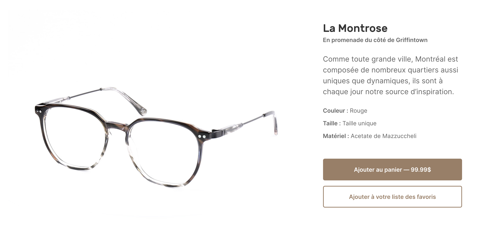

# 🎆 Alpine Product 360
Loop a series of images in a 360 rotatation carousel with this plugin for Vue.js

### 🙋🏼‍♂️ Vue.js user ? Check the plugin [Vue Product 360](https://github.com/moveideas/vue-product-360)



## Demo

[▶️ Try the demo](https://nsfpk.csb.app/) or [▶️ View the sandbox](https://codesandbox.io/s/charming-black-nsfpk?file=/index.html)

## Installation

Quick start guide for installing and configuring the plugin

### Install via npm

```sh
# Using npm
npm install @moveideas/alpine-product-360
```

```javascript
import alpineCarousel from '@moveideas/alpine-product-360';
// Make available to fill the x-data directive
window.alpineCarousel = alpineCarousel;
```

### Using via CDN 

To pull the plugin for quick demos, grab the latest build via CDN:

```html
<script type="module" src="https://cdn.jsdelivr.net/gh/moveideas/alpine-product-360@1.1.1/dist/index.min.js"></script>
```

## Usage

The plugin injects for you in the window object a function called `alpineCarousel`. Use this function creating a new component with the `x-data` directive, and initialize it with the `start` function. The `alpineCarousel` function takes two parameters:

- **images (required)**: An array of images to be looped
- **parameters** (optional): If you would like customize the plugin — [view parameters available](##Parameters)

```html
<div x-data="alpineCarousel(['URL1', 'URL2', 'URL3', {infinite: true}])" x-init="start()">
    
</div>
```

## Parameters

| Name | Type | Default Value | Description |
|-|-|-|-|-|
| speed | `Number` | `10` | Rotation speed |
| reverse | `Boolean` | `false` | Change the rotation direction |
| infinite | `Boolean` | `true` | Infinite loop |
| keep-position | `Boolean` | `true` | When the images prop change, the plugin keep the current position. Otherwhise, the carousel slide to the first image |

## Functions includes
`alpineCarousel` returns an object including the following functions. You could use it inside the component scope. 

### slideToRight() 
Slide the carousel to the right. If the loop is complete and if the `infinite` props is set to `true`, the carousel slide to the first images.

### slideToLeft()
Slide the carousel to the left. If the loop is complete and if the `infinite` props is set to `true`, the carousel slide to the last images.

### slideTo(position)
Slide the carousel to a specific position 

### setImages(images)
Use this function to load images 
